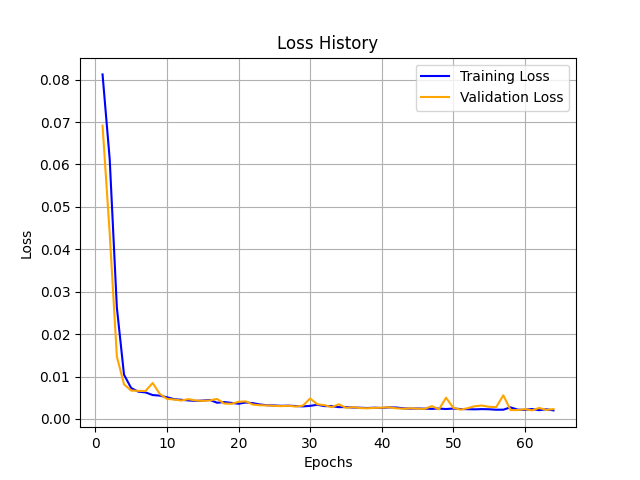

# About
This reposotory contains an application that uses algorithms for improving the resolution and quality of low-resolution images, algorithms included:
- nearest neighbor
- bilinear interpolation
- bicubic interpolation
- super-resolution convolutional neural network

The SRCNN model is a keras sequential model trained using [this dataset](https://www.kaggle.com/datasets/adityachandrasekhar/image-super-resolution), a trained version of it can be found on https://huggingface.co/Bazhe-RL/SRCNN.  
Results after 64 epochs: 


# Running
Install requirements
```sh
pip install -r requirements.txt
```
Run the script
```sh
python main.py
```
To use it on another image replace test.png with your image,
the resulting image can be found in /output
